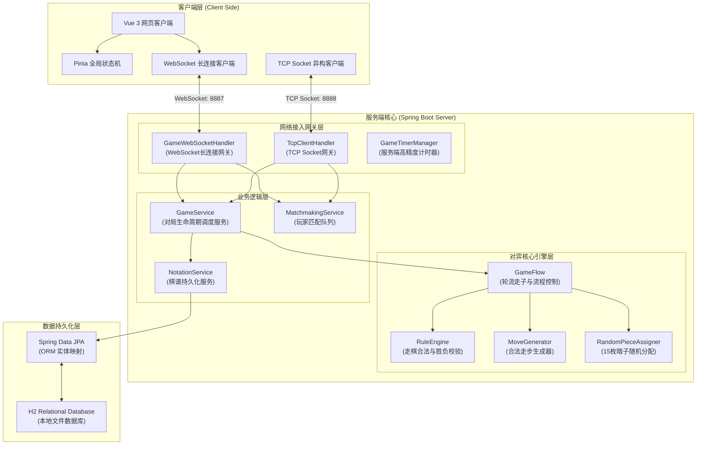
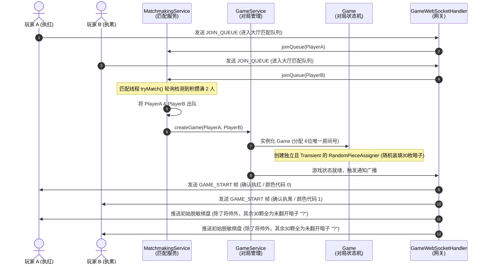
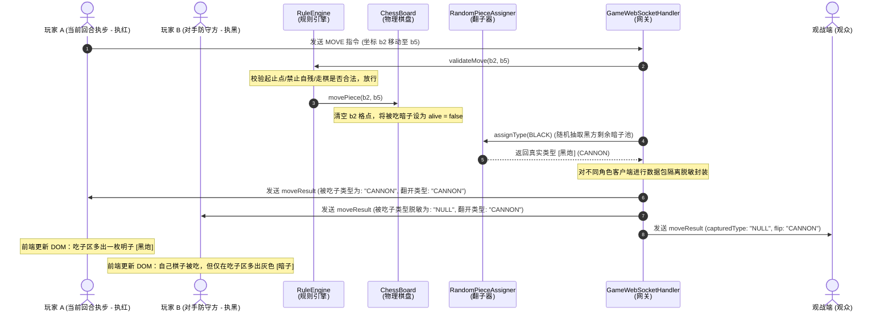
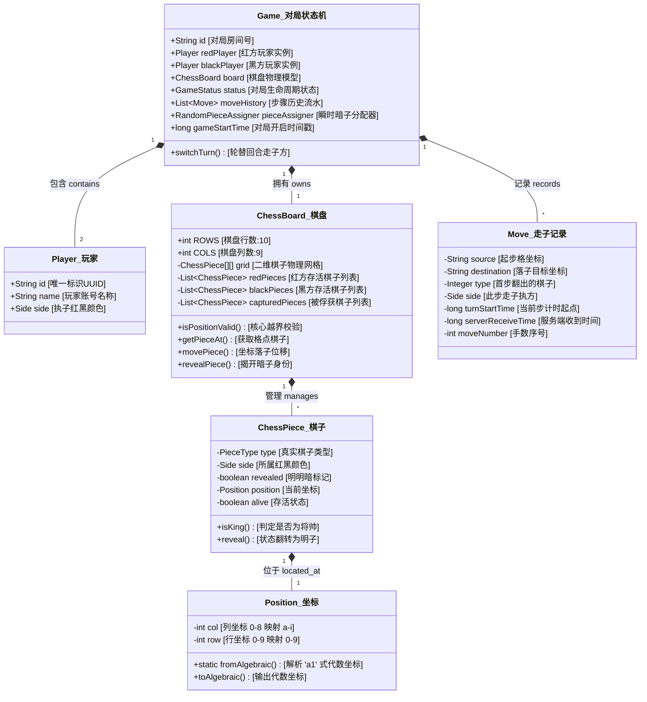

# 揭棋在线对弈平台 —— 核心工程原理图集 (排版修正版)

如果您在 VS Code 中已经安装了 **Markdown Preview Enhanced**，只需在此页面按快捷键 **`Ctrl + M` 然后按 `V`**，右侧就会自动渲染出精美的拓扑图、时序图和 UML 类图。
**右键点击生成的图表，选择“Save as PNG”即可保存为高清图片，然后直接插入您的 Word 实验报告中**！

---

### 1. 系统网络与分层拓扑架构图 (已修正换行)
展示 Web 客户端、TCP 异构对弈端、双通信网关、Service 业务服务层、游戏引擎层及 JPA 本地 H2 持久化层之间的全双工调用关系。

---

### 2. 大厅匹配与对弈初始化 —— 时序流程图 (已修正换行)
描述多房间模式下，玩家加入匹配队列、线程安全撮合、Game 独立随机翻子器初始化以及 GAME_START 消息分发的完整生命周期。

---

### 3. 吃暗子落子判定与防作弊脱敏 —— 时序流程图 (已修正换行)
详细展示了红方吃黑方暗子时，RuleEngine 走法过滤、RandomPieceAssigner 随机类型分配以及向不同连接（吃子方、防守方、观众）进行数据隔离脱敏传输的物理机制。

---

### 4. 平台核心领域类图 (UML Class Diagram - 中文对照版)
展示对弈平台后端的核心面向对象实体模型及各组件间的一对一、一对多聚合与依赖关系。

